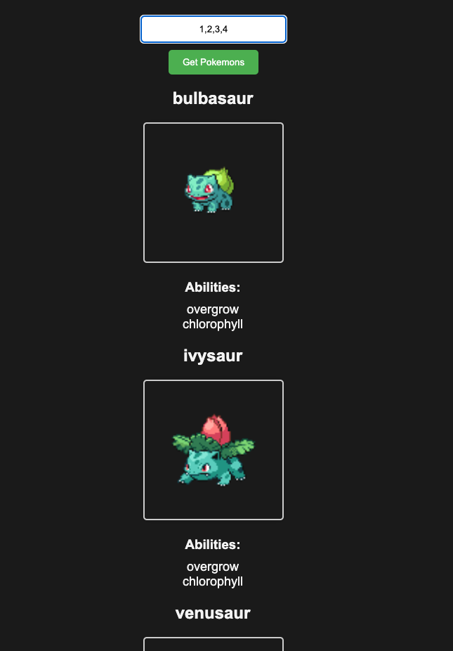

# Get Pokemons

> A simple website allows the user to get pokemon(s) by id.

## Table of contents

- [General info](#general-info)
- [Screenshots](#screenshots)
- [Technologies](#technologies)
- [Setup](#setup)
- [Features](#features)
- [Status](#status)
- [Inspiration](#inspiration)
- [Contact](#contact)

## General info

> The objective of the project is to practice using get requests and apply separation of concerns.

## Screenshots



## Technologies

- JavaScript
- HTML5
- CSS3
- VSC code

## Setup

- clone the repo.
- `npm install`

## Code Examples

```js
const getPokemonById = async (id) => {
  try {
    const res = await fetch(`https://pokeapi.co/api/v2/pokemon/${id}`);

    if (!res.ok) {
      throw new Error(`An error has occurred: ${res.status}`);
    }

    const data = await res.json();
    return data;
  } catch (err) {
    console.error('There was an error fetching the Pokémon:', err);
    return null;
  }
};

export default getPokemonById;
```

## Features

List of features ready and Todos for future development

-
-
-

To-do list:

-
-

## Status

Project is: _in progress_
